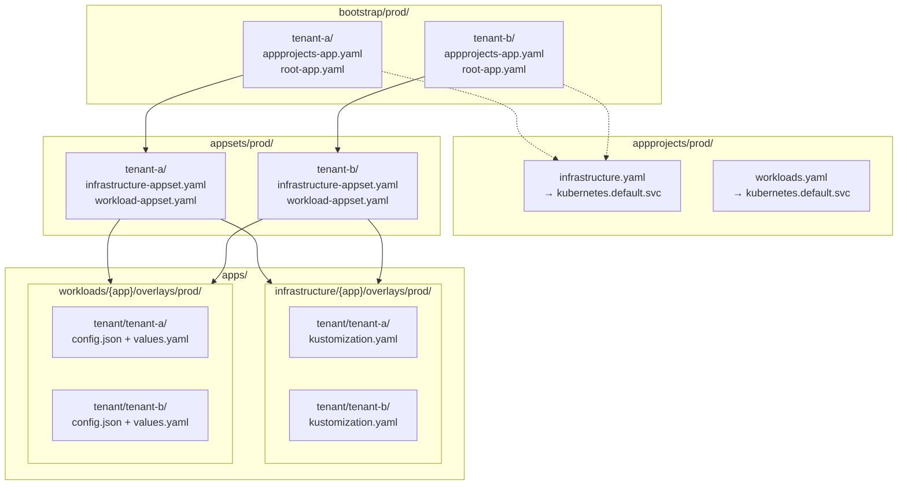

# Tenant-Aware Deployment Strategy (v2)

## Overview

Add **tenant** as a deployment dimension for the **prod** environment only. Two tenants: `tenant-a` and `tenant-b`. Each ArgoCD instance manages itself independently within its tenant — there is no multi-cluster hub. Each app (infrastructure or workload) can target one tenant, both tenants, or neither (by omitting the tenant directory). Default is both tenants.

## Key Design Decision: Model A — Independent Deployment Control

Each ArgoCD instance deploys **only** apps intended for its tenant. Tenant identity is determined by which bootstrap path an ArgoCD instance follows:

- An ArgoCD instance in `tenant-a` applies `bootstrap/prod/tenant-a/`
- An ArgoCD instance in `tenant-b` applies `bootstrap/prod/tenant-b/`

The destination server is always `https://kubernetes.default.svc` (self-managing). No multi-cluster destination URLs are needed.

**Dev** has no tenant awareness — it always uses the flat `bootstrap/dev/` and `appsets/dev/` structure.

---

## 1. Directory Structure

```
bootstrap/
├── dev/                              # unchanged — flat, no tenant
│   ├── appprojects-app.yaml
│   └── root-app.yaml                 # → appsets/dev/
└── prod/
    ├── tenant-a/                 # NEW — tenant-specific bootstrap
    │   ├── appprojects-app.yaml      # → appprojects/prod/ (same AppProjects)
    │   └── root-app.yaml             # → appsets/prod/tenant-a/
    └── tenant-b/                 # NEW — tenant-specific bootstrap
        ├── appprojects-app.yaml      # → appprojects/prod/
        └── root-app.yaml             # → appsets/prod/tenant-b/

appsets/
├── dev/                              # unchanged — flat, no tenant
│   ├── infrastructure-appset.yaml    # scans apps/infrastructure/*/overlays/dev
│   └── workload-appset.yaml          # scans apps/workloads/*/overlays/dev
└── prod/
    ├── tenant-a/                 # NEW — tenant-specific ApplicationSets
    │   ├── infrastructure-appset.yaml  # scans .../overlays/prod/tenant/tenant-a
    │   └── workload-appset.yaml        # scans .../overlays/prod/tenant/tenant-a
    └── tenant-b/                 # NEW — tenant-specific ApplicationSets
        ├── infrastructure-appset.yaml  # scans .../overlays/prod/tenant/tenant-b
        └── workload-appset.yaml        # scans .../overlays/prod/tenant/tenant-b

apps/
├── infrastructure/{app}/overlays/
│   ├── dev/                          # unchanged — flat, no tenant subdir
│   │   └── kustomization.yaml
│   └── prod/
│       ├── kustomization.yaml        # unchanged — shared env config
│       ├── *.yaml                    # unchanged — shared patches
│       └── tenant/                   # NEW
│           ├── tenant-a/
│           │   └── kustomization.yaml  # resources: - ../..
│           └── tenant-b/
│               └── kustomization.yaml  # resources: - ../..
└── workloads/{app}/overlays/
    ├── dev/                          # unchanged — flat
    │   ├── config.json
    │   └── values.yaml
    └── prod/
        ├── values.yaml               # unchanged — shared env values
        └── tenant/                   # NEW
            ├── tenant-a/
            │   ├── config.json       # chart deployment config (scanned by tenant appset)
            │   └── values.yaml       # tenant-specific helm values
            └── tenant-b/
                ├── config.json
                └── values.yaml
```

**Principle**: directory presence = deployment target. No tenant directory = no deployment to that tenant.

---

## 2. No tenant.json Files

Unlike the v1 design, **no `tenant.json` files** are needed. Tenant identity is implicit in the ApplicationSet path:

- [`appsets/prod/tenant-a/infrastructure-appset.yaml`](appsets/prod/tenant-a/infrastructure-appset.yaml) hardcodes the tenant path: `apps/infrastructure/*/overlays/prod/tenant/tenant-a`
- [`appsets/prod/tenant-b/infrastructure-appset.yaml`](appsets/prod/tenant-b/infrastructure-appset.yaml) hardcodes the tenant path: `apps/infrastructure/*/overlays/prod/tenant/tenant-b`

The generator is a simple `git.directories` — no matrix generator needed for infrastructure.

---

## 3. ApplicationSet Design

### 3.1 Infrastructure ApplicationSet

**File**: [`appsets/prod/tenant-a/infrastructure-appset.yaml`](appsets/prod/tenant-a/infrastructure-appset.yaml)

Simple `git.directories` generator (no matrix):

```yaml
generators:
  - git:
      repoURL: https://github.com/schmhj/cluster-config.git
      revision: HEAD
      directories:
        - path: apps/infrastructure/*/overlays/prod/tenant/tenant-a
template:
  metadata:
    name: "{{index .path.segments 2}}-prod-tenant-a"
    labels:
      tenant: tenant-a
spec:
  destination:
    server: https://kubernetes.default.svc
```

**Path segment mapping**:
| Segment Index | Value |
|---|---|
| `.path.segments[0]` | `apps` |
| `.path.segments[1]` | `infrastructure` |
| `.path.segments[2]` | app name (e.g., `traefik`) |
| `.path.segments[3]` | `overlays` |
| `.path.segments[4]` | `prod` |
| `.path.segments[5]` | `tenant` |
| `.path.segments[6]` | `tenant-a` |

**Application naming**: `{{index .path.segments 2}}-prod-tenant-a` → e.g., `traefik-prod-tenant-a`

### 3.2 Workload ApplicationSet

**File**: [`appsets/prod/tenant-a/workload-appset.yaml`](appsets/prod/tenant-a/workload-appset.yaml)

Matrix generator (`git.directories` × `git.files`):

```yaml
generators:
  - matrix:
      generators:
        - git:
            directories:
              - path: apps/workloads/*/overlays/prod/tenant/tenant-a
        - git:
            files:
              - path: "{{.path.path}}/config.json"
```

**Values path** (in `templatePatch`):
```yaml
- $values/apps/workloads/{{index .path.segments 2}}/base/values.yaml
- $values/apps/workloads/{{index .path.segments 2}}/overlays/prod/tenant/{{index .path.segments 6}}/values.yaml
```

---

## 4. AppProject Changes

**No changes from original.** All 4 AppProject manifests in [`appprojects/{dev,prod}/`](appprojects/dev/infrastructure.yaml) use a single destination:

```yaml
destinations:
  - namespace: "*"
    server: "https://kubernetes.default.svc"
```

No multi-cluster server URLs are needed since each ArgoCD instance manages itself.

---

## 5. Bootstrap Layer

### 5.1 Dev (unchanged)

```
bootstrap/dev/
├── appprojects-app.yaml    → deploys appprojects/dev/
└── root-app.yaml           → deploys appsets/dev/
```

### 5.2 Prod (tenant-aware)

```
bootstrap/prod/tenant-a/
├── appprojects-app.yaml    → deploys appprojects/prod/ (same AppProjects for both tenants)
└── root-app.yaml           → deploys appsets/prod/tenant-a/

bootstrap/prod/tenant-b/
├── appprojects-app.yaml    → deploys appprojects/prod/
└── root-app.yaml           → deploys appsets/prod/tenant-b/
```

Both tenant root apps point to the same [`appprojects/prod/`](appprojects/prod/) directory for AppProjects, but different ApplicationSet directories. This means both tenants share the same AppProject definitions (which is fine — they both use `kubernetes.default.svc`).

**Bootstrap commands per tenant**:

```bash
# tenant-a ArgoCD instance
kubectl apply -f bootstrap/prod/tenant-a/appprojects-app.yaml -n argocd
kubectl apply -f bootstrap/prod/tenant-a/root-app.yaml -n argocd

# tenant-b ArgoCD instance
kubectl apply -f bootstrap/prod/tenant-b/appprojects-app.yaml -n argocd
kubectl apply -f bootstrap/prod/tenant-b/root-app.yaml -n argocd
```

---

## 6. Scaffolder Updates

**File**: [`scripts/create-app.sh`](scripts/create-app.sh)

### Tenant Selection (Step 4/5)

Only shown when "prod" is among the selected environments:

```
Step 4/5: Target Tenants (prod)
  (1) tenant-a only
  (2) tenant-b only
  (3) both tenants (default)
```

### File Creation Logic

**For infrastructure apps**:
- Always creates `base/values.yaml` and `base/kustomization.yaml`
- Always creates `overlays/{env}/kustomization.yaml`
- Creates `overlays/prod/tenant/{tenant}/kustomization.yaml` (resources: `- ../..`) only for prod overlays
- Never creates `tenant.json` files

**For workload apps**:
- Always creates `base/values.yaml`
- For **dev** overlays: creates `config.json` directly in `overlays/dev/`
- For **prod** overlays: creates `values.yaml` and `config.json` in `overlays/prod/tenant/{tenant}/`
- Creates `overlays/{env}/values.yaml` as a shared placeholder

### Key guard condition

```bash
if [[ "$overlay_dir" == */prod && ${#TENANTS[@]} -gt 0 ]]; then
  # scaffold tenant subdirectories
else
  # scaffold flat (dev) files
fi
```

This ensures tenant directories are only created under prod overlays, even when both dev and prod are selected.

---

## 7. DevContainer Configuration

### [`config.sh`](.devcontainer/scripts/config.sh)

```bash
export ENVIRONMENT=prod
export TENANT=tenant-a
```

### [`post-start.sh`](.devcontainer/scripts/post-start.sh)

Prod bootstrap uses `$TENANT` to select the correct bootstrap path:

```bash
if [[ $ENVIRONMENT == "prod" ]]; then
    kubectl apply -f "bootstrap/prod/${TENANT:-tenant-a}/appprojects-app.yaml" -n argocd
    kubectl apply -f "bootstrap/prod/${TENANT:-tenant-a}/root-app.yaml" -n argocd
else
    kubectl apply -f bootstrap/dev/appprojects-app.yaml -n argocd
    kubectl apply -f bootstrap/dev/root-app.yaml -n argocd
fi
```

---

## 8. Sync Waves (unchanged)

| Wave | Component |
|------|-----------|
| 0 | AppProjects |
| 2 | sealed-secrets, namespaces |
| 3 | infra-secrets, argocd-config |
| 4 | cert-manager, traefik, reflector, grafana-alloy |
| 5 | Workload applications |

Tenant does not affect sync ordering.

---

## 9. Architecture Diagram



---

## 10. Complete File Change Inventory (v2)

| File | Change |
|------|--------|
| `bootstrap/prod/tenant-a/appprojects-app.yaml` | **NEW** — bootstraps AppProjects for tenant-a |
| `bootstrap/prod/tenant-a/root-app.yaml` | **NEW** — points to `appsets/prod/tenant-a/` |
| `bootstrap/prod/tenant-b/appprojects-app.yaml` | **NEW** — bootstraps AppProjects for tenant-b |
| `bootstrap/prod/tenant-b/root-app.yaml` | **NEW** — points to `appsets/prod/tenant-b/` |
| `appsets/prod/tenant-a/infrastructure-appset.yaml` | **NEW** — scans `tenant/tenant-a` dirs |
| `appsets/prod/tenant-a/workload-appset.yaml` | **NEW** — scans `tenant/tenant-a` dirs |
| `appsets/prod/tenant-b/infrastructure-appset.yaml` | **NEW** — scans `tenant/tenant-b` dirs |
| `appsets/prod/tenant-b/workload-appset.yaml` | **NEW** — scans `tenant/tenant-b` dirs |
| `appsets/prod/infrastructure-appset.yaml` | **DELETED** — superseded by tenant-specific versions |
| `appsets/prod/workload-appset.yaml` | **DELETED** — superseded by tenant-specific versions |
| `bootstrap/prod/appprojects-app.yaml` | **DELETED** — superseded by tenant-specific versions |
| `bootstrap/prod/root-app.yaml` | **DELETED** — superseded by tenant-specific versions |
| `appprojects/dev/infrastructure.yaml` | Unchanged (single `kubernetes.default.svc` destination) |
| `appprojects/dev/workloads.yaml` | Unchanged |
| `appprojects/prod/infrastructure.yaml` | Unchanged |
| `appprojects/prod/workloads.yaml` | Unchanged |
| `apps/infrastructure/*/overlays/prod/tenant/{tenant-a,tenant-b}/` | **NEW** — tenant kustomization overlays |
| `apps/workloads/*/overlays/prod/tenant/{tenant-a,tenant-b}/` | **NEW** — tenant-specific config.json + values.yaml |
| `.devcontainer/scripts/config.sh` | **MODIFIED** — added `TENANT` variable |
| `.devcontainer/scripts/post-start.sh` | **MODIFIED** — tenant-aware prod bootstrap |
| `scripts/create-app.sh` | **MODIFIED** — added tenant selection step, prod-only tenant scaffolding |

---

## 11. Implementation Notes

- **`ServerSideApply=true`** remains on infrastructure appsets only.
- **Production `selfHeal: false`** preserved on prod root-apps; `selfHeal: true` on prod ApplicationSets.
- **Dev `selfHeal: true`** on both dev root-app and dev ApplicationSets.
- **No tenant.json files** — tenant identity is implicit in the ApplicationSet path.
- **No matrix generator for infrastructure** — simple `git.directories` is sufficient since the tenant path is hardcoded.
- **Workload appsets still use matrix generator** — to read `config.json` for chart metadata.
- **Two-step bootstrap per tenant**: Apply `appprojects-app.yaml` (wave 0) first, then `root-app.yaml`.
- **All destinations** use `https://kubernetes.default.svc` — each ArgoCD instance manages itself.